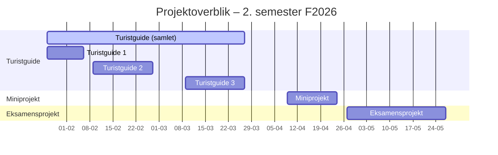

# Lektionsplan

<table>
<thead>
<tr>
  <th>Uge</th>
  <th>Dag</th>
  <th>Emner</th>
  <th>Underviser</th>
  <th>Bemærkninger</th>
</tr>
</thead>
<tbody>

<!-- UGE 35 -->
<tr><td colspan="5"><strong>Projekt:</strong> Turistguide 1</td></tr>
<tr><td colspan="5"><strong>Ugens overordnede emner:</strong> Spring Boot intro</td></tr>
<tr>
  <td>35</td>
  <td><a href="35/01_man_2026-08-24/README.md">Mandag 24-08-2026</a></td>
  <td>Introduktion til semester og Spring Boot</td>
  <td>ANIZ</td>
  <td></td>
</tr>

<tr>
  <td></td>
  <td><a href="35/02_tir_2026-08-25/README.md">Tirsdag 25-08-2026</a></td>
  <td>ITF:</td>
  <td>DE</td>
  <td></td>
</tr>

<tr>
  <td></td>
  <td><a href="35/03_ons_2026-08-26/README.md">Onsdag 26-08-2026</a></td>
  <td>Spring Boot, Turistguide 1</td>
  <td>ANIZ</td>
  <td>Online ?</td>
</tr>
<tr>
  <td></td>
  <td><a href="35/04_tor_2026-08-27/README.md">Torsdag 27-08-2026</a></td>
  <td>Check-in/vejledning på Turistguide 1</td>
  <td></td>
  <td></td>
</tr>

<tr>
  <td></td>
  <td><a href="35/05_fre_2026-08-28/README.md">Fredag 28-08-2026</a></td>
  <td>Spring Boot arkitektur + opgaver/konsolidering af Spring Boot</td>
  <td>JART</td>
  <td></td>
</tr>

<!-- UGE 36 -->
<tr><td colspan="5"><strong>Ugens overordnede emner:</strong> HTML/CSS</td></tr>
<tr>
  <td>36</td>
  <td><a href="36/01_man_2026-08-31/README.md">Mandag 31-08-2026</a></td>
  <td>HTML &amp; CSS</td>
  <td>ANIZ</td>
  <td></td>
</tr>
<tr>
  <td></td>
  <td><a href="36/02_tir_2026-09-01/README.md">Torsdag 03-09-2026</a></td>
  <td>ITF:</td>
  <td>DE</td>
  <td></td>
</tr>
<tr>
  <td></td>
  <td><a href="36/03_ons_2026-09-02/README.md">Onsdag 02-09-2026</a></td>
  <td>Check-in/vejledning på Turistguide 1</td>
  <td>ANIZ</td>
  <td>Online ?</td>
</tr>

<tr>
  <td></td>
  <td><a href="36/02_tir_2026-09-01/README.md">Tirsdag 01-09-2026</a></td>
  <td>Java Collections, Map</td>
  <td></td>
  <td></td>
</tr>

<tr>
  <td></td>
  <td><a href="36/05_fre_2026-09-04/README.md">Fredag 04-09-2026</a></td>
  <td>Feedback Turistguide 1</td>
  <td>JART</td>
  <td></td>
</tr>

<!-- UGE 37 -->
<tr><td colspan="5"><strong>Projekt:</strong> Turistguide 2</td></tr>
<tr><td colspan="5"><strong>Ugens overordnede emner:</strong> Spring Boot arkitektur, Thymeleaf</td></tr>
<tr>
  <td>37</td>
  <td><a href="37/01_man_2026-09-07/README.md">Mandag 07-09-2026</a></td>
  <td>Introduktion til ThymeLeaf</td>
  <td>ANIZ</td>
  <td></td>
</tr>
<tr>
  <td></td>
  <td><a href="37/02_tir_2026-09-08/README.md">Tirsdag 08-09-2026</a></td>
  <td>ITF:</td>
  <td>DE</td>
  <td></td>
</tr>

<tr>
  <td></td>
  <td><a href="37/03_ons_2026-09-09/README.md">Onsdag 09-09-2026</a></td>
  <td>Check-in/vejledning på Turistguide 2</td>
  <td>ANIZ</td>
  <td>Online ?</td>
</tr>

<tr>
  <td></td>
  <td><a href="37/04_tor_2026-09-10/README.md">Torsdag 10-09-2026</a></td>
  <td>ThymeLeaf, HTML forms &amp; Thymeleaf, Turistguide 2</td>
  <td></td>
  <td></td>
</tr>

<tr>
  <td></td>
  <td><a href="37/05_fre_2026-09-11/README.md">Fredag 11-09-2026</a></td>
  <td>MockMVC og test af Controller</td>
  <td>JART</td>
  <td></td>
</tr>

<!-- UGE 38 -->
<tr><td colspan="5"><strong>Ugens overordnede emner:</strong> Git og kodekvalitet</td></tr>
<tr>
  <td>38</td>
  <td><a href="38/01_man_2026-09-14/README.md">Mandag 14-09-2026</a></td>
  <td>Operativsystemer, command shell &amp; Git Bash</td>
  <td>ANIZ</td>
  <td></td>
</tr>

<tr>
  <td></td>
  <td><a href="38/02_tir_2026-09-15/README.md">Tirsdag 15-09-2026</a></td>
  <td>ITF:</td>
  <td>DE</td>
  <td></td>
</tr>

<tr>
  <td></td>
  <td><a href="38/03_ons_2026-09-16/README.md">Onsdag 16-09-2026</a></td>
  <td>Check-in/vejledning på Turistguide 2</td>
  <td>ANIZ</td>
  <td>Online ?</td>
</tr>

<tr>
  <td></td>
  <td><a href="38/04_tor_2026-09-17/README.md">Torsdag 17-09-2026</a></td>
  <td>Kode review med pull requests</td>
  <td>TOG</td>
  <td></td>
</tr>

<tr>
  <td></td>
  <td><a href="38/05_fre_2026-09-18/README.md">Fredag 18-09-2026</a></td>
  <td>Statisk kodeanalyse med tools</td>
  <td>JART</td>
  <td></td>
</tr>

<!-- UGE 39 -->
<tr><td colspan="5"><strong>Ugens overordnede emner:</strong> DevOps, CI/CD</td></tr>
<tr>
  <td>39</td>
  <td><a href="39/01_man_2026-09-21/README.md">Mandag 21-09-2026</a></td>
  <td>GitHub Actions 1</td>
  <td>ANIZ</td>
  <td></td>
</tr>

<tr>
  <td></td>
  <td><a href="39/02_tir_2026-09-22/README.md">Tirsdag 22-09-2026</a></td>
  <td>ITF:</td>
  <td>DE</td>
  <td></td>
</tr>

<tr>
  <td></td>
  <td><a href="39/03_ons_2026-09-23/README.md">Onsdag 23-09-2026</a></td>
  <td>GitHub Actions 2</td>
  <td>ANIZ</td>
  <td>Online?</td>
</tr>
<tr>
  <td></td>
  <td><a href="39/04_tor_2026-09-24/README.md">Torsdag 24-09-2026</a></td>
  <td>Check-in/vejledning på Turistguide 2</td>
  <td></td>
  <td></td>
</tr>

<tr>
  <td></td>
  <td><a href="39/05_fre_2026-09-25/README.md">Fredag 25-09-2026</a></td>
  <td>Feedback og review af Turistguide 2</td>
  <td>JART</td>
  <td>Online</td>
</tr>

<!-- UGE 40 -->
<tr><td colspan="5"><strong>Projekt:</strong> Turistguide 3</td></tr>
<tr><td colspan="5"><strong>Ugens overordnede emner:</strong> Databaser, SQL, E/R modellering</td></tr>
<tr>
  <td>40</td>
  <td><a href="40/01_man_2026-09-28/README.md">Mandag 28-09-2026</a></td>
  <td>E/R model og relationel model</td>
  <td>ANIZ</td>
  <td></td>
</tr>

<tr>
  <td></td>
  <td><a href="40/02_tir_2026-09-29/README.md">Tirsdag 29-09-2026</a></td>
  <td>ITF:</td>
  <td>DE</td>
  <td></td>
</tr>
<tr>
  <td></td>
  <td><a href="40/03_ons_2026-09-30/README.md">Onsdag 30-09-2026</a></td>
  <td>Introduktion til SQL og DDL</td>
  <td>ANIZ</td>
  <td>Online ?</td>
</tr>

<tr>
  <td></td>
  <td><a href="40/04_tor_2026-10-01/README.md">Torsdag 01-10-2026</a></td>
  <td>SQL og Turistguide 3</td>
  <td></td>
  <td></td>
</tr>

<tr>
  <td></td>
  <td><a href="40/05_fre_2026-10-02/README.md">Fredag 02-10-2026</a></td>
  <td>SQL joins</td>
  <td>JART</td>
  <td></td>
</tr>

<!-- UGE 41 -->
<tr><td colspan="5"><strong>Ugens overordnede emner:</strong> Jdbc, databaseintegration i Spring Boot, database deployment</td></tr>

<tr>
  <td>41</td>
  <td><a href="41/01_man_2026-10-05/README.md">Mandag 05-10-2026</a></td>
  <td>Normalisering</td>
  <td>ANIZ</td>
  <td></td>
</tr>

<tr>
  <td></td>
  <td>Tirsdag 15-09-2026</td>
  <td>ITF:</td>
  <td>DE</td>
  <td></td>
</tr>

<tr>
  <td></td>
  <td><a href="41/03_ons_2026-10-07/README.md">Onsdag 07-10-2026</a></td>
  <td>Check-in/vejledning på Turistguide 3</td>
  <td>ANIZ</td>
  <td>Online ?</td>
</tr>

<tr>
  <td></td>
  <td><a href="41/04_tor_2026-10-08Del1/README.md">Torsdag 08-10-2026</a></td>
  <td>JDBCtemplate og Spring 1, Turistguide del 3</td>
  <td></td>
  <td></td>
</tr>

<tr>
  <td></td>
  <td><a href="41/04_tor_2026-10-08Del2/README.md">Torsdag 08-10-2026</a></td>
  <td>JDBCtemplate og Spring 2, functional interfaces</td>
  <td>ANIZ</td>
  <td></td>
</tr>

<tr>
  <td></td>
  <td><a href="41/05_fre_2026-10-09/README.md">Fredag 09-10-2026</a></td>
  <td>Databasetransaktioner</td>
  <td></td>
  <td></td>
</tr>

<!-- UGE 42 -->
<tr><td colspan="5"><strong>EFTERÅRSFERIE</strong></td></tr>
<tr>
  <td>42</td>
  <td></td>
  <td>Undervisningsfri</td>
  <td></td>
  <td></td>
</tr>

<!-- UGE 43 -->
<tr><td colspan="5"><strong>Ugens overordnede emner:</strong> Testbar kode med lav kobling</td></tr>

<tr>
  <td>43</td>
  <td><a href="43/01_man_2026-10-12/README.md">Mandag 12-10-2026</a></td>
  <td>Azure deployment</td>
  <td></td>
  <td></td>
</tr>

<tr>
  <td></td>
  <td><a href="43/02_tir_2026-10-13/README.md">Tirsdag 13-10-2026</a></td>
  <td>ITF:</td>
  <td>DE</td>
  <td></td>
</tr>

<tr>
  <td></td>
  <td><a href="43/03_ons_2026-10-14/README.md">Onsdag 14-10-2026</a></td>
  <td>Database deployment</td>
  <td>ANIZ</td>
  <td>Online?</td>
</tr>

<tr>
  <td></td>
  <td><a href="43/04_tor_2026-10-15/README.md">Torsdag 15-10-2026</a></td>
  <td>Integrationstest med H2 database</td>
  <td></td>
  <td></td>
</tr>

<tr>
  <td></td>
  <td><a href="43/05_fre_2026-10-16/README.md">Fredag 27-03-2026</a></td>
  <td>Turistguide del 3 - feedback</td>
  <td></td>
  <td>Online?</td>
</tr>

<!-- UGE 44 -->
<tr><td colspan="5"><strong>Projekt:</strong> Miniprojekt</td></tr>
<tr><td colspan="5"><strong>Ugens overordnede emner:</strong> UX/UI, GitHub Projects</td></tr>
<tr><td colspan="5"><strong>Ugens overordnede emner:</strong> Testbar kode med lav kobling, sessions</td></tr>

<tr>
  <td>44</td>
  <td><a href="44/01_man_2026-10-26/README.md">Mandag 26-10-2026</a></td>
  <td>Kickoff - Wishlist-projekt &amp; GitHub Projects</td>
  <td></td>
  <td></td>
</tr>

<tr>
  <td></td>
  <td><a href="44/02_tir_2026-10-27/README.md">Tirsdag 27-11-2026</a></td>
  <td>ITF: Wishlist PO - møde</td>
  <td>DE</td>
  <td></td>
</tr>

<tr>
  <td></td>
  <td><a href="44/03_ons_2026-10-28/README.md">Onsdag 28-10-2026</a></td>
  <td>Wishlist - projektvejledning</td>
  <td></td>
  <td></td>
</tr>

<tr>
  <td></td>
  <td><a href="44/04_tor_2026-10-29/README.md">Torsdag 29-10-2026</a></td>
  <td>Fejlhåndtering i Spring Boot</td>
  <td></td>
  <td></td>
</tr>

<tr>
  <td></td>
  <td><a href="44/05_fre_2026-10-30/README.md">Fredag 30-10-2026</a></td>
  <td>Sessions</td>
  <td></td>
  <td></td>
</tr>

<!-- UGE 45 -->
<tr><td colspan="5"><strong>Ugens overordnede emner:</strong> Projektarbejde</td></tr>

<tr>
  <td>45</td>
<td><a href="45/01_man_2026-11-02/README.md">Mandag 02-11-2026</a></td>  <td>User interface design</td>
  <td>ANIZ</td>
  <td></td>
</tr>

<tr>
  <td></td>
  <td><a href="45/02_tir_2026-11-03/README.md">Tirsdag 03-11-2026</a></td>
  <td>ITF: projektvejledning</td>
  <td>DE</td>
  <td></td>
</tr>

<tr>
  <td></td>
  <td><a href="45/03_ons_2026-11-04/README.md">Onsdag 04-11-2026</a></td>
  <td>Check-in/vejledning på Wishlist</td>
  <td></td>
  <td>Online</td>
</tr>

<tr>
  <td></td>
  <td><a href="45/04_tor_2026-11-05/README.md">Tirsdag 05-11-2026</a></td>
  <td>Usability test</td>
  <td></td>
  <td></td>
</tr>

<tr>
  <td></td>
  <td><a href="45/05_fre_2026-11-06/README.md">Fredag 06-11-2026</a></td>
  <td>Wishlist - projektvejledning</td>
  <td>JART</td>
  <td></td>
</tr>

<!-- UGE 46 -->
<tr><td colspan="5"><strong>Ugens overordnede emner:</strong> Projektarbejde</td></tr>
<tr>
  <td>46</td>
  <td><a href="46/01_man_2026-11-09/README.md">Mandag 09-11-2026</a></td>
  <td>Afslutning Wishlist-projekt: Review, Readme og contributing, Wishlist projektvejledning</td>
  <td>ANIZ</td>
  <td>Online</td>
</tr>
<tr>
  <td></td>
  <td><a href="46/02_tir_2026-11-10/README.md">Tirsdag 10-11-2026</a></td>
  <td>ITF: Fremlæggelse</td>
  <td>DE</td>
  <td></td>
</tr>
<tr>
  <td></td>
  <td><a href="46/03_ons_2026-11-11/README.md">Onsdag 11-11-2026</a></td>
  <td>Forberedelse til SYS/PROG/TEK fremlæggelsen</td>
  <td>ANIZ</td>
  <td>Online</td>
</tr>
<tr>
  <td></td>
  <td><a href="46/04_tor_2026-11-12/README.md">Torsdag 12-11-2026</a></td>
  <td>Fremlæggelse SYS/PROG/TEK</td>
  <td></td>
  <td></td>
</tr>
<tr>
  <td></td>
  <td><a href="46/05_fre_2026-11-13/README.md">Fredag 13-11-2026</a></td>
  <td>Fremlæggelse SYS/PROG/TEK</td>
  <td></td>
  <td></td>
</tr>

<!-- UGE 47 -->
<tr><td colspan="5"><strong>Projekt:</strong> Eksamensprojekt</td></tr>
<tr><td colspan="5"><strong>Ugens overordnede emner:</strong> Projektstart</td></tr>
<tr>
  <td>47</td>
  <td><a href="47/01_man_2026-11-16/README.md">Mandag 16-11-2026</a></td>
  <td>Præsentation af eksamensprojekt (Sprint 0)</td>
  <td>ANIZ</td>
  <td></td>
</tr>
<tr>
  <td></td>
  <td><a href="45/04_tor_2026-11-05/README.md">Tirsdag 28-04-2026</a></td>
  <td>Usability test</td>
  <td>SIEB</td>
  <td></td>
</tr>
<tr>
  <td></td>
  <td><a href="47/01_man_2026-11-16/README.md">Onsdag 29-04-2026</a></td>
  <td>Præsentation af eksamensprojekt (Sprint 0)</td>
  <td>SIEB</td>
  <td></td>
</tr>
<tr>
  <td></td>
  <td><a href="47/02_tir_2026-11-17/README.md">Torsdag 30-04-2026</a></td>
  <td>ITF: PO-møde</td>
  <td></td>
  <td></td>
</tr>
<tr>
  <td></td>
  <td><a href="47/04_tor_2026-11-19/README.md">Fredag 01-05-2026</a></td>
  <td>Eksamensprojekt - sprint 1</td>
  <td>IANB</td>
  <td></td>
</tr>

<!-- UGE 48 -->
<tr><td colspan="5"><strong>Ugens overordnede emner:</strong> Projektarbejde</td></tr>
<tr>
  <td>48</td>
  <td><a href="49/01_man_2026-11-30/README.md">Mandag 04-05-2026</a></td>
  <td>Rapport, præsentation, eksamination</td>
  <td>MANY</td>
  <td></td>
</tr>
<tr>
  <td></td>
  <td><a href="49/02_tir_2026-12-01/README.md">Tirsdag 05-05-2026</a></td>
  <td>Eksamensprojekt - sprint 1</td>
  <td>IANB</td>
  <td></td>
</tr>
<tr>
  <td></td>
  <td><a href="49/03_ons_2026-12-02/README.md">Onsdag 06-05-2026</a></td>
  <td>Eksamensprojekt - statusmøde</td>
  <td>SIEB/MANY</td>
  <td>Online</td>
</tr>
<tr>
  <td></td>
  <td><a href="49/04_tor_2026-12-03/README.md">Torsdag 07-05-2026</a></td>
  <td>ITF: PO-møde</td>
  <td></td>
  <td></td>
</tr>
<tr>
  <td></td>
  <td><a href="49/05_fre_2026-12-04/README.md">Fredag 08-05-2026</a></td>
  <td>ITF:</td>
  <td></td>
  <td></td>
</tr>

<!-- UGE 49 -->
<tr><td colspan="5"><strong>Ugens overordnede emner:</strong> Projektarbejde</td></tr>
<tr>
  <td>49</td>
  <td><a href="49/01_man_2026-11-30/README.md">Mandag 30-11-2026</a></td>
  <td>Eksamensprojekt - sprint 3</td>
  <td>ANIZ</td>
  <td></td>
</tr>
<tr>
  <td></td>
  <td><a href="49/02_tir_2026-12-01/README.md">Tirsdag 01-12-2026</a></td>
  <td>ITF:</td>
  <td>DE</td>
  <td></td>
</tr>
<tr>
  <td></td>
  <td><a href="49/03_ons_2026-12-02/README.md">Onsdag 02-12-2026</a></td>
  <td>Eksamensprojekt - statusmøde</td>
  <td>ANIZ</td>
  <td>Online</td>
</tr>
<tr>
  <td></td>
  <td><a href="49/04_tor_2026-12-03/README.md">Torsdag 03-12-2026</a></td>
  <td>Eksamensprojekt</td>
  <td></td>
  <td></td>
</tr>
<tr>
  <td></td>
  <td><a href="49/05_fre_2026-12-04/README.md">Fredag 04-12-2026</a></td>
  <td>Eksamensprojekt</td>
  <td>JART</td>
  <td></td>
</tr>

<!-- UGE 50 -->
<tr><td colspan="5"><strong>Ugens overordnede emner:</strong> Projektarbejde</td></tr>
<tr>
  <td>50</td>
  <td><a href="50/01_man_2026-12-07/README.md">Mandag 07-12-2026</a></td>
  <td>Eksamensprojekt - sprint 4</td>
  <td>ANIZ</td>
  <td>Online</td>
</tr>
<tr>
  <td></td>
  <td><a href="50/02_tir_2026-12-08/README.md">Tirsdag 08-12-2026</a></td>
  <td>ITF: PO-møde</td>
  <td>DE</td>
  <td>Online</td>
</tr>
<tr>
  <td></td>
  <td><a href="50/03_ons_2026-12-09/README.md">Onsdag 09-12-2026</a></td>
  <td>Eksamensprojekt - statusmøde</td>
  <td>ANIZ</td>
  <td>Online</td>
</tr>
<tr>
  <td></td>
  <td><a href="50/04_tor_2026-12-10/README.md">Torsdag 10-12-2026</a></td>
  <td>Eksamensprojekt - statusmøde</td>
  <td></td>
  <td></td>
</tr>
<tr>
  <td></td>
  <td><a href="50/05_fre_2026-12-11/README.md">Fredag 11-12-2026</a></td>
  <td>Eksamensprojekt - sprint 4</td>
  <td>JART</td>
  <td>Online</td>
</tr>

<!-- UGE 51 -->
<tr><td colspan="5"><strong>Ugens overordnede emner:</strong> Projektarbejde</td></tr>

<tr>
  <td>51</td>
  <td><a href="51/01_man_2026-12-14/README.md">Mandag 14-12-2026</a></td>
  <td>Eksamensprojekt - sprint 5</td>
  <td>ANIZ</td>
  <td>Online</td>
</tr>

<tr>
  <td></td>
  <td><a href="51/02_tir_2026-12-15/README.md">Tirsdag 15-12-2026</a></td>
  <td>Eksamensprojekt</td>
  <td>DE</td>
  <td>Online</td>
</tr>
<tr>
  <td></td>
  <td><a href="51/03_ons_2026-12-16/README.md">Onsdag 16-12-2026</a></td>
  <td>Eksamensprojekt - aflevering</td>
  <td>ANIZ</td>
  <td>Online</td>
</tr>

</tbody>
</table>

# Projekter

