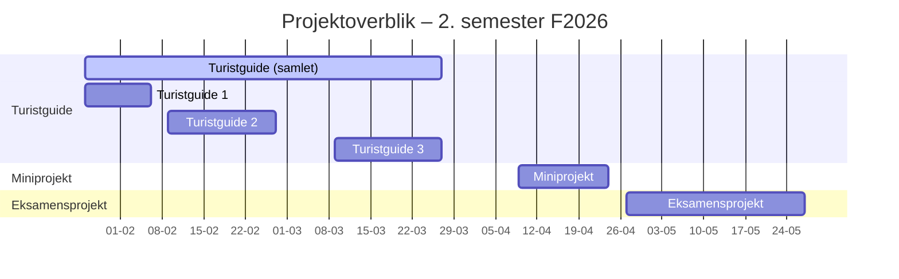

# Lektionsplan

<table>
<thead>
<tr>
  <th>Uge</th>
  <th>Dag</th>
  <th>Emner</th>
  <th>Underviser</th>
  <th>Bemærkninger</th>
</tr>
</thead>
<tbody>

<!-- UGE 05 -->
<tr><td colspan="5"><strong>Projekt:</strong> Turistguide 1</td></tr>
<tr><td colspan="5"><strong>Ugens overordnede emner:</strong> Spring Boot intro</td></tr>
<tr>
  <td>05</td>
  <td><a href="35/01_man_2026-08-24/README.md">Mandag 26-01-2026</a></td>
  <td>Introduktion til semester og Spring Boot</td>
  <td>ANIZ</td>
  <td></td>
</tr>
<tr>
  <td></td>
  <td><a href="35/Onsdag%2026-08-2026/README.md">Tirsdag 27-01-2026</a></td>
  <td>Spring Boot, Turistguide 1</td>
  <td>TOG</td>
  <td></td>
</tr>
<tr>
  <td></td>
  <td><a href="35/04_tor_2026-08-27/README.md">Onsdag 28-01-2026</a></td>
  <td>Check-in/vejledning på Turistguide 1</td>
  <td>ANIZ</td>
  <td>Online</td>
</tr>
<tr>
  <td></td>
  <td><a href="35/02_tir_2026-08-25/README.md">Torsdag 29-01-2026</a></td>
  <td>ITF:</td>
  <td></td>
  <td></td>
</tr>
<tr>
  <td></td>
  <td><a href="35/05_fre_2026-08-28/README.md">Fredag 30-01-2026</a></td>
  <td>Spring Boot arkitektur + opgaver/konsolidering af Spring Boot</td>
  <td>JART</td>
  <td></td>
</tr>

<!-- UGE 06 -->
<tr><td colspan="5"><strong>Ugens overordnede emner:</strong> HTML/CSS</td></tr>
<tr>
  <td>06</td>
  <td><a href="36/01_man_2026-08-31/README.md">Mandag 02-02-2026</a></td>
  <td>HTML &amp; CSS</td>
  <td>MANY</td>
  <td></td>
</tr>
<tr>
  <td></td>
  <td><a href="36/04_tor_2026-09-03/README.md">Tirsdag 03-02-2026</a></td>
  <td>Java Collections, Map</td>
  <td>IANB</td>
  <td></td>
</tr>
<tr>
  <td></td>
  <td><a href="36/03_ons_2026-09-02/README.md">Onsdag 04-02-2026</a></td>
  <td>Check-in/vejledning på Turistguide 1</td>
  <td>IANB/MANY</td>
  <td>Online</td>
</tr>
<tr>
  <td></td>
  <td><a href="36/02_tir_2026-09-01/README.md">Torsdag 05-02-2026</a></td>
  <td>ITF:</td>
  <td></td>
  <td></td>
</tr>
<tr>
  <td></td>
  <td><a href="36/05_fre_2026-09-04/README.md">Fredag 06-02-2026</a></td>
  <td>Feedback Turistguide 1</td>
  <td>SIEB</td>
  <td></td>
</tr>

<!-- UGE 07 -->
<tr><td colspan="5"><strong>Projekt:</strong> Turistguide 2</td></tr>
<tr><td colspan="5"><strong>Ugens overordnede emner:</strong> Spring Boot arkitektur, Thymeleaf</td></tr>
<tr>
  <td>07</td>
  <td><a href="37/01_man_2026-09-07/README.md">Mandag 09-02-2026</a></td>
  <td>Introduktion til ThymeLeaf</td>
  <td>SIEB</td>
  <td></td>
</tr>
<tr>
  <td></td>
  <td><a href="37/04_tor_2026-09-10/README.md">Tirsdag 10-02-2026</a></td>
  <td>ThymeLeaf, HTML forms &amp; Thymeleaf, Turistguide 2</td>
  <td>SIEB</td>
  <td></td>
</tr>
<tr>
  <td></td>
  <td><a href="37/03_ons_2026-09-09/README.md">Onsdag 11-02-2026</a></td>
  <td>Check-in/vejledning på Turistguide 2</td>
  <td>IANB/MANY</td>
  <td>Online</td>
</tr>
<tr>
  <td></td>
  <td><a href="37/02_tir_2026-09-08/README.md">Torsdag 12-02-2026</a></td>
  <td>ITF:</td>
  <td></td>
  <td></td>
</tr>
<tr>
  <td></td>
  <td><a href="37/05_fre_2026-09-11/README.md">Fredag 13-02-2026</a></td>
  <td>MockMVC og test af Controller</td>
  <td>IANB</td>
  <td></td>
</tr>

<!-- UGE 08 -->
<tr><td colspan="5"><strong>Ugens overordnede emner:</strong> Git og kodekvalitet</td></tr>
<tr>
  <td>08</td>
  <td><a href="38/01_man_2026-09-14/README.md">Mandag 16-02-2026</a></td>
  <td>Operativsystemer, command shell &amp; Git Bash</td>
  <td>MANY</td>
  <td></td>
</tr>
<tr>
  <td></td>
  <td><a href="38/04_tor_2026-09-17/README.md">Tirsdag 17-02-2026</a></td>
  <td>Kode review med pull requests</td>
  <td>SIEB</td>
  <td></td>
</tr>
<tr>
  <td></td>
  <td><a href="38/03_ons_2026-09-16/README.md">Onsdag 18-02-2026</a></td>
  <td>Check-in/vejledning på Turistguide 2</td>
  <td>IANB/MANY</td>
  <td>Online</td>
</tr>
<tr>
  <td></td>
  <td><a href="38/02_tir_2026-09-15/README.md">Torsdag 19-02-2026</a></td>
  <td>ITF:</td>
  <td></td>
  <td></td>
</tr>
<tr>
  <td></td>
  <td><a href="38/05_fre_2026-09-18/README.md">Fredag 20-02-2026</a></td>
  <td>Statisk kodeanalyse med tools</td>
  <td>IANB</td>
  <td></td>
</tr>

<!-- UGE 09 -->
<tr><td colspan="5"><strong>Ugens overordnede emner:</strong> DevOps, CI/CD</td></tr>
<tr>
  <td>09</td>
  <td><a href="39/01_man_2026-09-21/README.md">Mandag 23-02-2026</a></td>
  <td>GitHub Actions 1</td>
  <td>MANY</td>
  <td></td>
</tr>
<tr>
  <td></td>
  <td><a href="39/03_ons_2026-09-23/README.md">Tirsdag 24-02-2026</a></td>
  <td>GitHub Actions 2</td>
  <td>MANY</td>
  <td></td>
</tr>
<tr>
  <td></td>
  <td><a href="39/04_tor_2026-09-24/README.md">Onsdag 25-02-2026</a></td>
  <td>Check-in/vejledning på Turistguide 2</td>
  <td>SIEB/MANY</td>
  <td>Online</td>
</tr>
<tr>
  <td></td>
  <td><a href="39/02_tir_2026-09-22/README.md">Torsdag 26-02-2026</a></td>
  <td>ITF:</td>
  <td></td>
  <td></td>
</tr>
<tr>
  <td></td>
  <td><a href="39/05_fre_2026-09-25/README.md">Fredag 27-02-2026</a></td>
  <td>Feedback og review af Turistguide 2</td>
  <td>IANB</td>
  <td>Online</td>
</tr>

<!-- UGE 10 -->
<tr><td colspan="5"><strong>Projekt:</strong> Turistguide 3</td></tr>
<tr><td colspan="5"><strong>Ugens overordnede emner:</strong> Databaser, SQL, E/R modellering</td></tr>
<tr>
  <td>10</td>
  <td><a href="40/01_man_2026-09-28/README.md">Mandag 02-03-2026</a></td>
  <td>E/R model og relationel model</td>
  <td>MANY</td>
  <td></td>
</tr>
<tr>
  <td></td>
  <td><a href="40/03_ons_2026-09-30/README.md">Tirsdag 03-03-2026</a></td>
  <td>Introduktion til SQL og DDL</td>
  <td>SIEB</td>
  <td>(AFLYST)</td>
</tr>
<tr>
  <td></td>
  <td><a href="40/04_tor_2026-10-01/README.md">Onsdag 04-03-2026</a></td>
  <td>SQL</td>
  <td>MANY</td>
  <td>Online</td>
</tr>
<tr>
  <td></td>
  <td><a href="40/05_fre_2026-10-02/README.md">Torsdag 05-03-2026</a></td>
  <td>SQL joins</td>
  <td>IANB</td>
  <td></td>
</tr>
<tr>
  <td></td>
  <td><a href="41/01_man_2026-10-05/README.md">Fredag 06-03-2026</a></td>
  <td>Normalisering</td>
  <td>IANB</td>
  <td></td>
</tr>

<!-- UGE 11 -->
<tr><td colspan="5"><strong>Ugens overordnede emner:</strong> Jdbc, databaseintegration i Spring Boot, database deployment</td></tr>
<tr>
  <td>11</td>
  <td><a href="41/02_tir_2026-10-06/README.md">Mandag 09-03-2026</a></td>
  <td>JDBCtemplate og Spring 1, Turistguide del 3</td>
  <td>MANY</td>
  <td></td>
</tr>
<tr>
  <td></td>
  <td><a href="41/03_ons_2026-10-07/README.md">Tirsdag 10-03-2026</a></td>
  <td>JDBCtemplate og Spring 2, functional interfaces</td>
  <td>SIEB</td>
  <td></td>
</tr>
<tr>
  <td></td>
  <td><a href="41/05_fre_2026-10-09/README.md">Onsdag 11-03-2026</a></td>
  <td>Azure deployment</td>
  <td>MANY</td>
  <td>Samlæst</td>
</tr>
<tr>
  <td></td>
  <td><a href="43/01_man_2026-10-12/README.md">Torsdag 12-03-2026</a></td>
  <td>Database deployment</td>
  <td>IANB</td>
  <td></td>
</tr>
<tr>
  <td></td>
  <td><a href="44/02_tir_2026-10-13/README.md">Fredag 13-03-2026</a></td>
  <td>Databasetransaktioner</td>
  <td>IANB</td>
  <td></td>
</tr>

<!-- UGE 12 -->
<tr><td colspan="5"><strong>Ugens overordnede emner:</strong> Testbar kode med lav kobling</td></tr>
<tr>
  <td>12</td>
  <td><a href="43/03_ons_2026-10-14/README.md">Mandag 16-03-2026</a></td>
  <td>Integrationstest med H2 database</td>
  <td>MANY</td>
  <td></td>
</tr>
<tr>
  <td></td>
  <td><a href="43/05_fre_2026-10-16/README.md">Tirsdag 17-03-2026</a></td>
  <td>Vejledning turistguide 3</td>
  <td>SIEB</td>
  <td></td>
</tr>
<tr>
  <td></td>
  <td><a href="43R/01_man_2026-10-26/README.md">Onsdag 18-03-2026</a></td>
  <td>Check-in/vejledning på Turistguide 3</td>
  <td>IANB/MANY</td>
  <td>Online</td>
</tr>
<tr>
  <td></td>
  <td><a href="44/05_fre_2026-11-30/README.md">Torsdag 19-03-2026</a></td>
  <td>ITF:</td>
  <td></td>
  <td></td>
</tr>
<tr>
  <td></td>
  <td><a href="44/04_tor_2026-10-29/README.md">Fredag 20-03-2026</a></td>
  <td>Fejlhåndtering i Spring Boot</td>
  <td>IANB</td>
  <td></td>
</tr>

<!-- UGE 13 -->
<tr><td colspan="5"><strong>Ugens overordnede emner:</strong> Testbar kode med lav kobling, sessions</td></tr>
<tr>
  <td>13</td>
  <td><a href="13/01_man_2026-03-23/README.md">Mandag 23-03-2026</a></td>
  <td>Vejledning turistguide</td>
  <td>SIEB</td>
  <td></td>
</tr>
<tr>
  <td></td>
  <td><a href="44/05_fre_2026-10-30/README.md">Tirsdag 24-03-2026</a></td>
  <td>Sessions</td>
  <td>SIEB</td>
  <td></td>
</tr>
<tr>
  <td></td>
  <td><a href="13/03_ons_2026-03-25/README.md">Onsdag 25-03-2026</a></td>
  <td>UNDERVISNINGFRI (Digital udviklingsdag)</td>
  <td></td>
  <td></td>
</tr>
<tr>
  <td></td>
  <td><a href="13/04_tor_2026-03-26/README.md">Torsdag 26-03-2026</a></td>
  <td>ITF:</td>
  <td></td>
  <td></td>
</tr>
<tr>
  <td></td>
  <td><a href="13/05_fre_2026-03-27/README.md">Fredag 27-03-2026</a></td>
  <td>Turistguide del 3 - feedback</td>
  <td>MANY</td>
  <td>Online</td>
</tr>

<!-- UGE 14 -->
<tr><td colspan="5"><strong>PÅSKEFERIE</strong></td></tr>
<tr>
  <td>14</td>
  <td></td>
  <td>Undervisningsfri</td>
  <td></td>
  <td></td>
</tr>

<!-- UGE 15 -->
<tr><td colspan="5"><strong>Projekt:</strong> Miniprojekt</td></tr>
<tr><td colspan="5"><strong>Ugens overordnede emner:</strong> UX/UI, GitHub Projects</td></tr>
<tr>
  <td>15</td>
  <td><a href="15/01_man_2026-04-06/README.md">Mandag 06-04-2026</a></td>
  <td>Undervisningsfri (2. påskedag)</td>
  <td></td>
  <td></td>
</tr>
<tr>
  <td></td>
  <td><a href="15/02_tir_2026-04-07/README.md">Tirsdag 07-04-2026</a></td>
  <td>User interface design</td>
  <td>SIEB</td>
  <td></td>
</tr>
<tr>
  <td></td>
  <td><a href="15/03_ons_2026-04-08/README.md">Onsdag 08-04-2026</a></td>
  <td>Kickoff - Wishlist-projekt &amp; GitHub Projects</td>
  <td>MANY</td>
  <td>Samlæst</td>
</tr>
<tr>
  <td></td>
  <td><a href="15/04_tor_2026-04-09/README.md">Torsdag 09-04-2026</a></td>
  <td>ITF: Wishlist PO - møde</td>
  <td></td>
  <td></td>
</tr>
<tr>
  <td></td>
  <td><a href="15/05_fre_2026-04-10/README.md">Fredag 10-04-2026</a></td>
  <td>Wishlist - projektvejledning</td>
  <td>IANB</td>
  <td></td>
</tr>

<!-- UGE 16 -->
<tr><td colspan="5"><strong>Ugens overordnede emner:</strong> Projektarbejde</td></tr>
<tr>
  <td>16</td>
  <td><a href="45/01_man_2026-11-02/README.md">Mandag 13-04-2026</a></td>
  <td>Wishlist projektvejledning</td>
  <td>MANY</td>
  <td>Online</td>
</tr>
<tr>
  <td></td>
  <td><a href="45/04_tor_2026-11-05/README.md">Tirsdag 14-04-2026</a></td>
  <td>Usability test</td>
  <td>SIEB</td>
  <td></td>
</tr>
<tr>
  <td></td>
  <td><a href="45/03_ons_2026-11-04/README.md">Onsdag 15-04-2026</a></td>
  <td>Check-in/vejledning på Wishlist</td>
  <td>IANB/MANY</td>
  <td>Online</td>
</tr>
<tr>
  <td></td>
  <td><a href="45/02_tir_2026-11-03/README.md">Torsdag 16-04-2026</a></td>
  <td>ITF: projektvejledning</td>
  <td></td>
  <td></td>
</tr>
<tr>
  <td></td>
  <td><a href="45/05_fre_2026-11-06/README.md">Fredag 17-04-2026</a></td>
  <td>Wishlist - projektvejledning</td>
  <td>IANB</td>
  <td></td>
</tr>

<!-- UGE 17 -->
<tr><td colspan="5"><strong>Ugens overordnede emner:</strong> Projektarbejde</td></tr>
<tr>
  <td>17</td>
  <td><a href="46/01_man_2026-04-20/README.md">Mandag 20-04-2026</a></td>
  <td>Readme og contributing, Wishlist projektvejledning</td>
  <td>MANY</td>
  <td>Online</td>
</tr>
<tr>
  <td></td>
  <td><a href="46/02_tir_2026-04-21/README.md">Tirsdag 21-04-2026</a></td>
  <td>Wishlist projektvejledning</td>
  <td>SIEB</td>
  <td></td>
</tr>
<tr>
  <td></td>
  <td><a href="46/03_ons_2026-04-22/README.md">Onsdag 22-04-2026</a></td>
  <td>Wishlist - projektvejledning</td>
  <td>IANB/MANY</td>
  <td>Online</td>
</tr>
<tr>
  <td></td>
  <td><a href="46/04_tor_2026-04-23/README.md">Torsdag 23-04-2026</a></td>
  <td>ITF: Fremlæggelse</td>
  <td></td>
  <td></td>
</tr>
<tr>
  <td></td>
  <td><a href="46/01_man_2026-11-09/README.md">Fredag 24-04-2026</a></td>
  <td>Afslutning Wishlist-projekt: eksamenstræning &amp; retrospective</td>
  <td>IANB</td>
  <td></td>
</tr>

<!-- UGE 18 -->
<tr><td colspan="5"><strong>Projekt:</strong> Eksamensprojekt</td></tr>
<tr><td colspan="5"><strong>Ugens overordnede emner:</strong> Projektstart</td></tr>
<tr>
  <td>18</td>
  <td><a href="45/05_fre_2026-11-06/README.md">Mandag 27-04-2026</a></td>
  <td>Wishlist projekt feedback fortsat (eksamenstræning)</td>
  <td>IANB</td>
  <td></td>
</tr>
<tr>
  <td></td>
  <td><a href="45/04_tor_2026-11-05/README.md">Tirsdag 28-04-2026</a></td>
  <td>Usability test</td>
  <td>SIEB</td>
  <td></td>
</tr>
<tr>
  <td></td>
  <td><a href="47/01_man_2026-11-16/README.md">Onsdag 29-04-2026</a></td>
  <td>Præsentation af eksamensprojekt (Sprint 0)</td>
  <td>SIEB</td>
  <td></td>
</tr>
<tr>
  <td></td>
  <td><a href="47/02_tir_2026-11-17/README.md">Torsdag 30-04-2026</a></td>
  <td>ITF: PO-møde</td>
  <td></td>
  <td></td>
</tr>
<tr>
  <td></td>
  <td><a href="47/04_tor_2026-11-19/README.md">Fredag 01-05-2026</a></td>
  <td>Eksamensprojekt - sprint 1</td>
  <td>IANB</td>
  <td></td>
</tr>

<!-- UGE 19 -->
<tr><td colspan="5"><strong>Ugens overordnede emner:</strong> Projektarbejde</td></tr>
<tr>
  <td>19</td>
  <td><a href="49/01_man_2026-11-30/README.md">Mandag 04-05-2026</a></td>
  <td>Rapport, præsentation, eksamination</td>
  <td>MANY</td>
  <td></td>
</tr>
<tr>
  <td></td>
  <td><a href="49/02_tir_2026-12-01/README.md">Tirsdag 05-05-2026</a></td>
  <td>Eksamensprojekt - sprint 1</td>
  <td>IANB</td>
  <td></td>
</tr>
<tr>
  <td></td>
  <td><a href="49/03_ons_2026-12-02/README.md">Onsdag 06-05-2026</a></td>
  <td>Eksamensprojekt - statusmøde</td>
  <td>SIEB/MANY</td>
  <td>Online</td>
</tr>
<tr>
  <td></td>
  <td><a href="49/04_tor_2026-12-03/README.md">Torsdag 07-05-2026</a></td>
  <td>ITF: PO-møde</td>
  <td></td>
  <td></td>
</tr>
<tr>
  <td></td>
  <td><a href="49/05_fre_2026-12-04/README.md">Fredag 08-05-2026</a></td>
  <td>ITF:</td>
  <td></td>
  <td></td>
</tr>

<!-- UGE 20 -->
<tr><td colspan="5"><strong>Ugens overordnede emner:</strong> Projektarbejde</td></tr>
<tr>
  <td>20</td>
  <td><a href="50/01_man_2026-12-07/README.md">Mandag 11-05-2026</a></td>
  <td>ITF:</td>
  <td></td>
  <td></td>
</tr>
<tr>
  <td></td>
  <td><a href="50/02_tir_2026-12-08/README.md">Tirsdag 12-05-2026</a></td>
  <td>Eksamensprojekt - sprint 1</td>
  <td>IANB</td>
  <td></td>
</tr>
<tr>
  <td></td>
  <td><a href="50/03_ons_2026-12-09/README.md">Onsdag 13-05-2026</a></td>
  <td>Eksamensprojekt - statusmøde</td>
  <td>SIEB/MANY</td>
  <td>Online</td>
</tr>
<tr>
  <td></td>
  <td><a href="50/04_tor_2026-12-10/README.md">Torsdag 14-05-2026</a></td>
  <td>Undervisningsfri (Kr. Himmelfart)</td>
  <td></td>
  <td></td>
</tr>
<tr>
  <td></td>
  <td><a href="50/05_fre_2026-12-11/README.md">Fredag 15-05-2026</a></td>
  <td>Undervisningsfri (Kr. Himmelfart)</td>
  <td></td>
  <td></td>
</tr>

<!-- UGE 21 -->
<tr><td colspan="5"><strong>Ugens overordnede emner:</strong> Projektarbejde</td></tr>
<tr>
  <td>21</td>
  <td><a href="51/01_man_2026-12-14/README.md">Mandag 18-05-2026</a></td>
  <td>Eksamensprojekt - sprint 2</td>
  <td>SIEB</td>
  <td>Online</td>
</tr>
<tr>
  <td></td>
  <td><a href="51/02_tir_2026-12-15/README.md">Tirsdag 19-05-2026</a></td>
  <td>Eksamensprojekt - sprint 2</td>
  <td>MANY</td>
  <td>Online</td>
</tr>
<tr>
  <td></td>
  <td><a href="51/03_ons_2026-12-16/README.md">Onsdag 20-05-2026</a></td>
  <td>Eksamensprojekt - statusmøde</td>
  <td>IANB/MANY</td>
  <td>Online</td>
</tr>
<tr>
  <td></td>
  <td><a href="51/04_tor_2026-05-21/README.md">Torsdag 21-05-2026</a></td>
  <td>ITF: PO-møde</td>
  <td></td>
  <td></td>
</tr>
<tr>
  <td></td>
  <td><a href="51/05_fre_2026-05-22/README.md">Fredag 22-05-2026</a></td>
  <td>Eksamensprojekt - sprint 2</td>
  <td>MANY</td>
  <td>Online</td>
</tr>

<!-- UGE 22 -->
<tr><td colspan="5"><strong>Ugens overordnede emner:</strong> Projektarbejde</td></tr>
<tr>
  <td>22</td>
  <td><a href="46Ver2/01_man_2026-05-25/README.md">Mandag 25-05-2026</a></td>
  <td>Undervisningsfri (Pinsemandag)</td>
  <td></td>
  <td></td>
</tr>
<tr>
  <td></td>
  <td><a href="46Ver2/02_tir_2026-05-26/README.md">Tirsdag 26-05-2026</a></td>
  <td>Eksamensprojekt - sprint 2</td>
  <td>SIEB</td>
  <td>Online</td>
</tr>
<tr>
  <td></td>
  <td><a href="46Ver2/03_ons_2026-05-27/README.md">Onsdag 27-05-2026</a></td>
  <td>Eksamensprojekt - aflevering</td>
  <td>SIEB/MANY</td>
  <td>Online</td>
</tr>
<tr>
  <td></td>
  <td><a href="47/03_ons_2026-11-18/README.md">Torsdag 28-05-2026</a></td>
  <td></td>
  <td></td>
  <td></td>
</tr>
<tr>
  <td></td>
  <td><a href="47/05_fre_2026-11-20/README.md">Fredag 29-05-2026</a></td>
  <td></td>
  <td></td>
  <td></td>
</tr>

</tbody>
</table>

# Projekter

